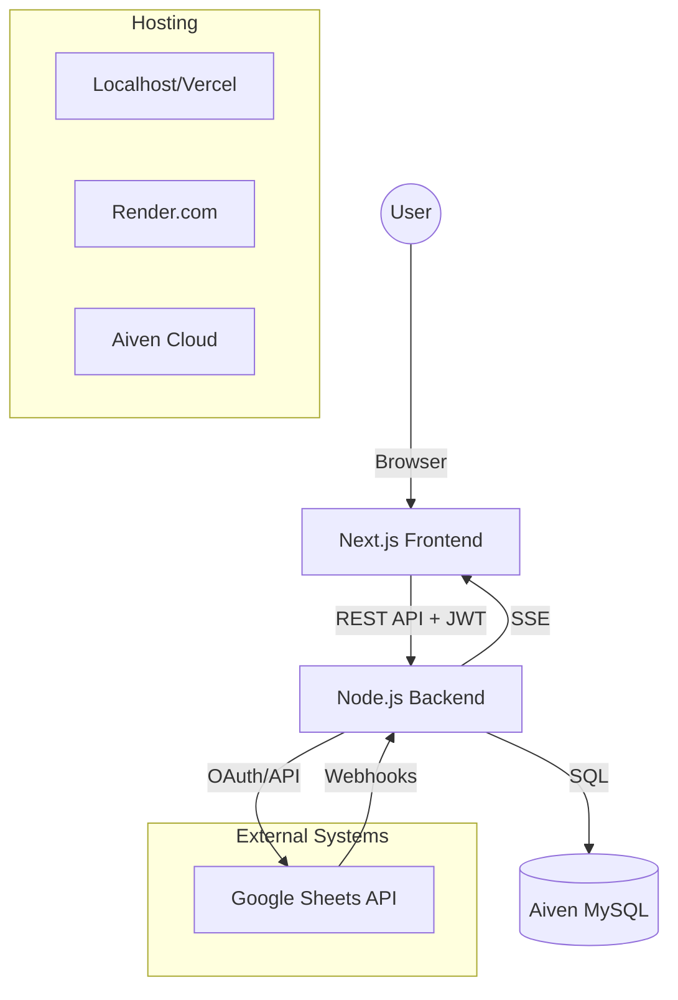
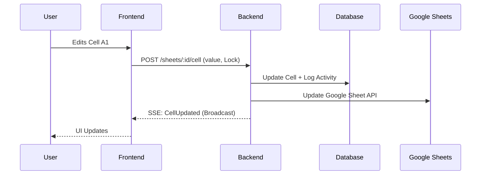

# System Architecture: Sheet Connect

Sheet Connect is a full-stack application designed to synchronize data between a custom web-based data grid and Google Sheets. It provides real-time locking, two-way synchronization, and detailed audit logging.

## Tech Stack

| Layer | Technology |
|-------|------------|
| **Frontend** | Next.js (App Router), Tailwind CSS, Shadcn UI, SWR |
| **Backend** | Node.js, Express.js, TypeScript |
| **Database** | MySQL (Hosted on Aiven for Production) |
| **Authentication** | JWT (Custom) + Google OAuth 2.0 |
| **Real-time** | Server-Sent Events (SSE) |

## High-Level Architecture

## Core Workflows

### 1. Data Synchronization
- **Import**: Pulls data from a specific Google Sheet and populates the internal MySQL database.
- **Sync**: A two-way process where internal changes are pushed to Google Sheets, and external changes (detected via webhooks or manual trigger) are merged back.
- **Conflict Resolution**: The system uses an "Internal Wins" strategy for simultaneous edits, but tracks external version IDs where possible.

### 2. Real-time Locking (Concurrency Control)
To prevent data corruption, the system implements a locking mechanism:
- When a user starts editing a cell, a "lock" is broadcasted via SSE.
- Other users see the cell as "Locked" in real-time.
- Locks have a TTL (Time-to-Live) to prevent permanent deadlocks if a user disconnects.

### 3. Real-time Feedback Loop
**Problem**: Traditional polling for updates is inefficient and creates lag.
**Solution**: We chose a **Purely Event-Driven Architecture**. By removing all "polling" and "revalidation-on-focus," the system relies 100% on the Webhook -> Backend -> SSE -> Frontend flow. This ensures zero unnecessary bandwidth usage and provides sub-second sync only when actual data changes occur.

### 4. Pure Event-Driven Architecture (Polling-Free)
To ensure zero unnecessary network overhead and maximum efficiency:
- **No Polling**: The frontend does not use intervals or focus-revalidation to fetch data.
- **Event-Driven Mutations**: UI state is updated only when the backend broadcasts an event (via SSE) or when a local manual action is performed.
- **Backend Trigger**: Updates occur only when the Google Sheets Webhook confirms a change or an internal API call succeeds.

### 5. Google Sheets Integration
- **OAuth**: Users connect their Google account. The backend securely stores `refresh_tokens`.
- **Apps Script Webhook**: A lightweight script attached to the Google Sheet sends a POST request to our backend whenever a cell is modified directly in the sheet.

## Data Flow Diagram

